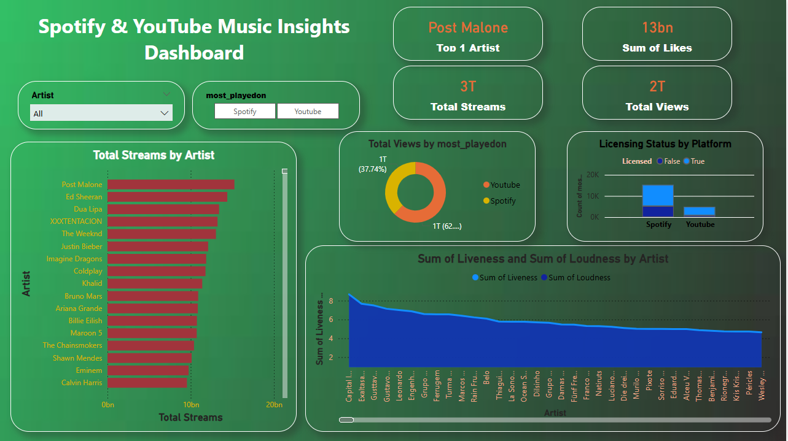

# 🎵 Spotify & YouTube Music Insights Dashboard + SQL Analytics

This project dives deep into the world of music data using a cleaned dataset from Spotify and YouTube. It involves powerful SQL queries for insights, data visualization using Power BI, and a full-blown music analytics dashboard that displays streaming behavior, artist performance, and licensing trends.

## 📊 Project Highlights

- Created a **Power BI dashboard** to visualize artist-wise statistics.
- Executed **comprehensive SQL queries** using PostgreSQL to extract valuable insights.
- Analyzed key metrics such as views, likes, comments, liveness, loudness, licensing, and more.
- Supported data-driven decision-making with clean, insightful visuals.

## 🖥 Dashboard Preview



## 📁 Dataset Used

- File: `cleaned_dataset.csv`
- Columns: Track Name, Artist, Album, Album Type, Licensed, Views, Likes, Comments, Streams, Energy, Liveness, Loudness, Danceability, Official Video, Platform

## 🧠 SQL Queries (PostgreSQL)

### 🟢 Easy Level

1. Retrieve the names of all tracks that have more than 1 billion streams.
2. List all albums along with their respective artists.
3. Get the total number of comments for tracks where `licensed = TRUE`.
4. Find all tracks that belong to the album type `single`.
5. Count the total number of tracks by each artist.

### 🟡 Medium Level

6. Calculate the average danceability of tracks in each album.
7. Find the top 5 tracks with the highest energy values.
8. List all tracks with views and likes where `official_video = TRUE`.
9. For each album, calculate the total views of all associated tracks.
10. Retrieve the track names that have been streamed on Spotify more than YouTube.

### 🔴 Advanced Level

11. Find the top 3 most-viewed tracks for each artist using window functions.
12. Write a query to find tracks where the `liveness` score is above the average.
13. Use a `WITH` clause to calculate the difference between the highest and lowest energy values for tracks in each album.

## 🛠 Tech Stack

- **SQL:** PostgreSQL
- **Visualization:** Power BI
- **Language:** SQL, DAX (Power BI)
- **Tools:** Power BI Desktop, pgAdmin

## 🚀 How to Run Locally

1. Clone the repository or download ZIP:
   ```bash
   git clone https://github.com/praveen5102/spotify-music-insights-dashboard.git
   cd spotify-music-insights-dashboard
